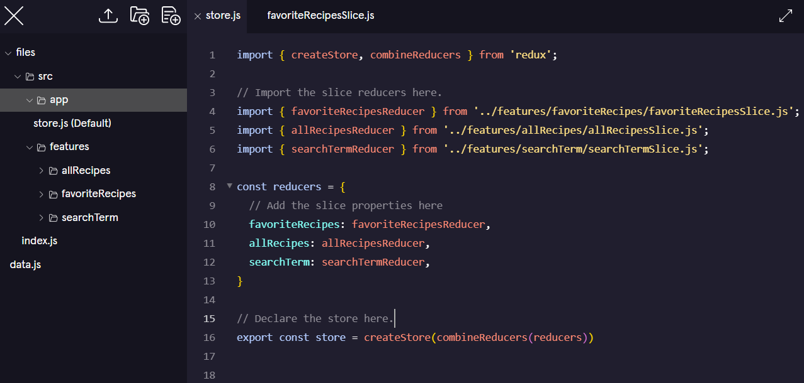

Quando lo stato di un'applicazione è suddiviso in più slice, di solito ogni azione modifica solo una slice alla volta. Per questo motivo, è consigliato che il tipo di ogni azione segua il formato `nomeSlice/descrizioneAzione`, così da chiarire quale slice dello stato deve essere aggiornata.

Ad esempio, in un'applicazione todo con una slice `todos` nello stato, il tipo di azione per aggiungere un nuovo todo potrebbe essere `todos/addTodo`.

Esempio di slice:

```js
import { createSlice } from '@reduxjs/toolkit';

const todosSlice = createSlice({
    name: 'todos',
    initialState: [],
    reducers: {
        addTodo: (state, action) => {
            state.push({ text: action.payload, completed: false });
        },
        toggleTodo: (state, action) => {
            const todo = state.find((t, i) => i === action.payload);
            if (todo) {
                todo.completed = !todo.completed;
            }
        }
    }
});

export const { addTodo, toggleTodo } = todosSlice.actions;
export default todosSlice.reducer;
```

nell'altro file 
```js
import { configureStore } from '@reduxjs/toolkit';
import todosReducer from './todosSlice';

export const store = configureStore({
  reducer: {
    todos: todosReducer
  }
});
```

the store‘s reducer function is called each time an action is dispatched. It is passed the action and the current state as arguments and returns the store‘s next state. 


